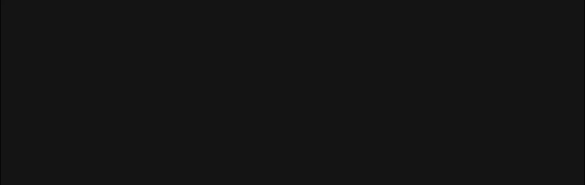
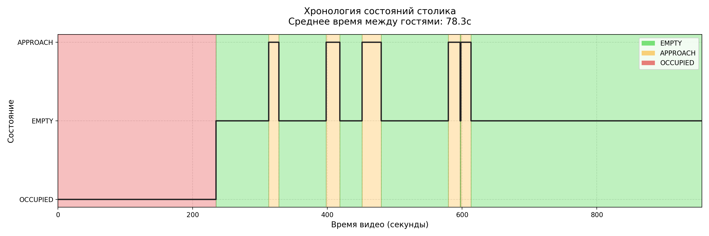

# table-watcher
Прототип системы компьютерного зрения для мониторинга состояния столика по видео. Детектирует присутствие человека (YOLO/OpenCV), фиксирует события (пусто, занято, подход), считает время реакции и базовую аналитику. Включает визуализацию ROI и смену состояния в реальном времени.



## Описание решения

Система строится на трёх последовательных этапах обработки каждого кадра видео.

**Детекция людей.** Каждый кадр передаётся в предобученную модель YOLOv8n. Из всех детекций оставляем только класс `person` с уверенностью выше порогового значения. Затем проверяем, попадает ли центр найденного bounding box в заранее заданную зону столика (ROI). Результат — булево значение: есть человек в зоне или нет.

**Конечный автомат (FSM).** Булево значение из детектора поступает в `TableMonitor` — класс, реализующий конечный автомат с тремя состояниями:

```       
Блок-схема работы (Граф состояний):
-----------------------------------
      [ СТАРТ ]
          |
          v
    +-----------+       человек обнаружен (> N кадров)       +--------------+
    |   EMPTY   | ------------------------------------------>|   APPROACH   |
    | (Свободно)| <----------------------------------------- |   (Подход)   |
    +-----------+       человек ушел (> K кадров)            +--------------+
          ^                                                         |
          |                                                         | задержка (> M кадров)
          |             человек ушел (> K кадров)                   v
          |                                                  +--------------+
          +--------------------------------------------------|   OCCUPIED   |
                                                             |   (Занято)   |
                                                             +--------------+
```

Прямой переход из сигнала детектора в состояние не делается — между ними стоит дебаунс: состояние меняется только если детектор стабильно показывает одно и то же на протяжении `N` кадров подряд. Это защищает от мерцания модели при движении или перекрытии. Состояние `APPROACH` — особое: оно фиксируется исключительно при первом появлении человека после подтверждённого `EMPTY`, именно его временна́я метка используется как момент «подхода к столу».

**Аналитика.** Каждый переход состояния записывается с временно́й меткой в Pandas DataFrame. По парам событий `EMPTY → APPROACH` вычисляется время реакции для каждого цикла. Итоговая метрика — среднее, медиана, минимум и максимум времени между уходом гостей и первым подходом к столу.

## Отчет о проделанной работе
При разработки системы я использовал следующие подходы
1. Для переходов между состояниями я реализовал патерн машина состояний, где каждое состояние это отдельный класс, что позволяет гипко управлять каждым переходом, и легко добавлять новые состояния. Плюс благодаря такому подходу очень просто понять правила переходов между состояниями
2. Что бы решить проблемму дребезка я ввел пароговое значение которое нужно преодалеть, что бы перейти в новое состояние, это решает проблемму когда человек, проподает из кадра, например его голова перекрывается светильником или когда он начинает встовать из-за стола, без системы пароговых значение, система начинает колебаца и переходить то в состояни занято то в состояние свободно
3. Также я реализовал систему плагинов, что бы было легко добавлять новые функциональные возможности, не меняя и не вникая в существующий код
4. Реализованна функциональность которая делает кскриншот, в момент когда мы пытаемся перейти в новое состояние, что бы можно было легко анализировать работу системы

---

## Оглавление

1. [Быстрый старт](#быстрый-старт)
2. [Установка зависимостей](#установка-зависимостей)
3. [Архитектура](#архитектура)
4. [Логика детекции событий](#логика-детекции-событий)
5. [Параметры запуска](#параметры-запуска)
6. [Результаты](#результаты)
7. [Структура проекта](#структура-проекта)
8. [Примеры выходных файлов](#примеры-выходных-файлов)

---

## Быстрый старт

Если вы используете **Linux** или **macOS**, для полной настройки и запуска проекта достаточно выполнить одну команду:

```bash
make
```

**Что произойдет после запуска:**
1. Автоматическая установка всех необходимых зависимостей.
2. Загрузка тестовых видеофайлов.
3. Запуск процесса обработки видео.


```bash
# Минимальный запуск — откроется окно выбора зоны столика
python main.py --video videos/video_2.mp4 --live

# С явными координатами зоны (без интерактивного выбора)
python main.py --video videos/video_2.mp4 --live --roi 285 160 1036 890

# С пропуском кадров, чтобы ускорить обработку
python main.py --video videos/video_2.mp4 --live --roi 285 160 1036 890 --step 20

# Запуск без показа окна, работает значительно быстрее
python main.py --video videos/video_2.mp4 --step 20

# Полный запуск с визуализацией в окне
python main.py --video videos/video_2.mp4 \
    --roi 285 160 1036 890 \
    --live \
    --confidence 0.45 \
    --empty-frames 200 \
    --occupied-frames 15
```

Все выходные файлы сохраняются в папку `outputs/<дата_время>_<имя_видео>/`.

---

## Установка зависимостей
```bash
python -m venv venv
```

```bash
# Windows
venv\Scripts\activate
# Linux
source venv/bin/activate
```

```bash
pip install -r requirements.txt
```

**`requirements.txt`:**

```
pandas==3.0.1
pytest==9.0.2
opencv-python==4.13.0.92
ultralytics==8.4.30

gdown==5.2.1
```

> ⚠️ При первом запуске Ultralytics автоматически загрузит веса модели **YOLOv8n** (~6 МБ).  
> Для офлайн-работы скопируйте файл `yolov8n.pt` в корень проекта.

---

## Архитектура

Система построена на трёх независимых слоях, связанных через **плагин-архитектуру**:

```
┌─────────────────────────────────────────────────────────────────┐
│                         main.py                                 │
│  (парсинг аргументов · валидация · сборка плагинов · запуск)    │
└─────────────────────────────┬───────────────────────────────────┘
                              │
                              ▼
┌─────────────────────────────────────────────────────────────────┐
│                      VideoProcessor                             │
│  ┌──────────────┐    ┌──────────────┐    ┌──────────────────┐   │
│  │  YOLOv8n     │───►│ TableMonitor │───►│    Plugins[]     │   │
│  │  (детекция)  │    │  (FSM-логика)│    │  (вся отрисовка  │   │
│  └──────────────┘    └──────────────┘    │   и аналитика)   │   │
└─────────────────────────────────────────┴──────────────────────┘
```

### Конечный автомат (FSM)

Граф переходов состояний для одного столика:

```
    [ СТАРТ ]
        │
        ▼
  ┌──────────┐  occupied ≥ N кадров   ┌──────────────┐
  │  EMPTY   │ ──────────────────────►│   APPROACH   │
  │(свободно)│ ◄──────────────────────│   (подход)   │
  └──────────┘  empty ≥ K кадров      └──────────────┘
        ▲                                     │
        │                                     │ occupied ≥ M кадров
        │    empty ≥ K кадров                 ▼
        │                             ┌──────────────┐
        └─────────────────────────────│   OCCUPIED   │
                                      │  (стол занят)│
                                      └──────────────┘
```

| Состояние  | Цвет рамки | Описание                                       |
|------------|------------|------------------------------------------------|
| `EMPTY`    | 🟢 Зелёный  | В зоне столика нет людей                       |
| `APPROACH` | 🟠 Оранжевый| Человек появился — возможная посадка / уборка  |
| `OCCUPIED` | 🔴 Красный  | Гость подтверждён (сидит достаточно долго)     |

**Дебаунс (защита от дребезга детектора):**  
Переход происходит только после **N подряд идущих кадров** с одним и тем же результатом. Это исключает ложные срабатывания от случайных прохожих или артефактов детекции.

---

## Логика детекции событий

### 1. Детекция людей

Используется **YOLOv8n** — самая лёгкая и быстрая модель линейки YOLOv8 (Ultralytics).  
Детектируется только класс `person` (id=0), остальные объекты игнорируются.

**Проверка попадания в зону столика:**  
Вместо пересечения bbox с ROI используется **«точка ног»** — середина нижнего края bbox `((x1+x2)//2, y2)`. Это устраняет ложные срабатывания, когда человек стоит рядом со столом, но его bbox частично перекрывает зону.

```
  ┌──────────────────────────┐
  │                          │
  │    bbox человека         │
  │                          │
  └────────────●─────────────┘
               │ foot_point (x, y2)
               │
  ┌────────────▼─────────────┐
  │      ROI (зона стола)    │ ← проверяем попадание foot_point
  └──────────────────────────┘
```

### 2. Фиксируемые события

| Событие                      | Триггер                                                           |
|------------------------------|-------------------------------------------------------------------|
| `EMPTY`                      | Зона пуста на протяжении `--empty-frames` кадров подряд          |
| `APPROACH` (подход)          | Человек в зоне `--occupied-frames` кадров подряд после `EMPTY`   |
| `OCCUPIED` (подтверждение)   | Человек не уходит ещё `--stay-frames` кадров после `APPROACH`    |

### 3. Бизнес-цикл (метрика ТЗ)

Главная метрика считается для полной тройки:

```
OCCUPIED → EMPTY → APPROACH
    │          │        │
    │          │        └── новый гость / уборщик подошёл
    │          └─────────── стол пустой (измеряем это время ↓)
    └────────────────────── предыдущий гость ушёл

wait_time = APPROACH.start_sec − OCCUPIED.end_sec
```

> **«Среднее время между уходом гостя и подходом следующего человека»**

---

## Параметры запуска

```
usage: main.py [-h] --video PATH [--roi X Y W H]
               [--model NAME] [--confidence FLOAT] [--step N]
               [--empty-frames N] [--occupied-frames N] [--stay-frames N]
               [--output-path DIR] [--output PATH] [--snapshots DIR]
               [--no-overlay] [--live] [--scale FLOAT]
               [--no-progress] [--verbose]
```

| Параметр             | По умолчанию  | Описание                                                    |
|----------------------|---------------|-------------------------------------------------------------|
| `--video`            | *(обязателен)*| Путь к входному видеофайлу                                  |
| `--roi X Y W H`      | интерактивно  | Координаты зоны столика в пикселях                          |
| `--model`            | `yolov8n.pt`  | YOLO-модель: `yolov8n/s/m/l/x.pt`                          |
| `--confidence`       | `0.4`         | Порог уверенности детектора `[0.0–1.0]`                     |
| `--step`             | `1`           | Запускать YOLO каждые N кадров (ускорение без потери точности)|
| `--empty-frames`     | `200`         | Кадров пустоты для перехода в `EMPTY`                       |
| `--occupied-frames`  | `15`          | Кадров присутствия для перехода в `APPROACH`                |
| `--stay-frames`      | `150`         | Кадров в `APPROACH` для перехода в `OCCUPIED`               |
| `--live`             | выкл.         | Показывать видео в окне в реальном времени                  |
| `--no-overlay`       | выкл.         | Фоновый режим: аналитика без записи видео                   |
| `--output-path`      | `outputs`     | Корневая папка для всех сессий                              |

**Горячие клавиши в режиме `--live`:**

| Клавиша     | Действие              |
|-------------|-----------------------|
| `Q` / `ESC` | Прервать обработку    |
| `ПРОБЕЛ`    | Пауза / продолжить    |

---

## Результаты

### Тестовое видео

- **Файл:** `video_2.mp4`
- **Столик:** зона `x=285 y=160 w=1036 h=890`
- **Модель:** `YOLOv8n` (confidence=0.45)

### Полученные метрики

| Метрика                                          | Значение  |
|--------------------------------------------------|-----------|
| Завершённых циклов (OCCUPIED → EMPTY → APPROACH) | **1**     |
| Среднее время пустого стола между гостями        | **78.33 с**|
| Медиана                                          | **78.33 с**|
| Минимум / Максимум                               | **78.33 / 78.33 с**|

> Результаты зависят от конкретного видео. Для получения точных цифр запустите систему

### Пример проблемного кадра

Детектор иногда ложно срабатывает на силуэты за окном и официантов,  
проходящих мимо — дебаунс (`--empty-frames`, `--occupied-frames`) нивелирует эти артефакты.

---

## Структура проекта

```
table-monitor/
├── main.py                         # Точка входа, CLI (Для удобства запуска)
├── requirements.txt
├── README.md
├── settings/
│   └── table_config.json           # Сохранённые ROI по именам видеофайлов
├── src/
│   ├── __init__.py
│   ├── main.py                     # Точка входа, CLI
│   ├── table_monitor.py            # FSM-логика (TableMonitor, состояния, интервалы)
│   ├── video_processor.py          # Цикл обработки видео, детекция YOLO, BasePlugin
│   ├── plugins.py                  # Все встроенные плагины
│   └── utils/
│       ├── __init__.py
│       ├── formatters.py           # Форматтеры
│       ├── roi_manager.py          # Загрузка / интерактивный выбор ROI
│       └── session_dir.py          # Создание папки сессии с timestamp
└── outputs/
    └── 2025-01-15_143022_video1/   # Пример папки сессии
        ├── output.mp4              # Видео с визуализацией
        ├── report.txt              # Текстовый отчёт (TaskReportPlugin)
        ├── timeline.png            # График хронологии состояний
        ├── cycles.csv              # Таблица бизнес-циклов (Pandas)
        ├── intervals_data.csv      # Все интервалы состояний
        ├── interval_report.txt     # Интервальная аналитика
        └── snapshots/              # PNG-скриншоты в момент событий FSM
            ├── frame_001234_OCCUPIED_to_EMPTY.png
            └── frame_002081_EMPTY_to_APPROACH.png
```

---

## Примеры выходных файлов

### `report.txt` (TaskReportPlugin)

```
======================================================
  Отчёт: детекция уборки столиков
======================================================
  Видео:          videos/video_2.mp4
  ROI:            x=285 y=160 w=1036 h=890
  Всего кадров:   14341
  FPS:            15.0

  Аналитика
  ────────────────────────────────────
  Циклов завершено:  1
  Циклов открытых:   0
  Среднее время:     78.33 сек
  Медиана:           78.33 сек
  Минимум:           78.33 сек
  Максимум:          78.33 сек

  События
  ────────────────────────────────────
  00:03:54.60  OCCUPIED → EMPTY
  00:05:12.93  EMPTY    → APPROACH
  00:05:27.93  APPROACH → EMPTY
  00:06:38.27  EMPTY    → APPROACH
  00:06:58.60  APPROACH → EMPTY
  00:07:31.60  EMPTY    → APPROACH
  00:07:59.93  APPROACH → EMPTY
  00:09:39.60  EMPTY    → APPROACH
  00:09:57.27  APPROACH → EMPTY
  00:09:58.27  EMPTY    → APPROACH
  00:10:13.27  APPROACH → EMPTY

  Циклы (стол освободился → подход)
  ────────────────────────────────────
  empty=00:03:54.60  approach=00:05:12.93  delta=78.3s  [OK]
======================================================
```

### `timeline.png`


График с цветовой заливкой интервалов:
- 🟢 `EMPTY` — зелёный
- 🟠 `APPROACH` — оранжевый  
- 🔴 `OCCUPIED` — красный

Вертикальные пунктирные линии отмечают момент каждого события FSM.

### `cycles.csv`

```csv
occupied_start_sec,occupied_end_sec,occupied_duration,empty_start_sec,empty_end_sec,approach_start_sec,wait_time,is_complete
0.0,234.6,234.6,234.6,312.933,312.933,78.333,True
```

---

## Дизайн-решения и trade-offs

**Почему YOLOv8n, а не вычитание фона?**  
Вычитание фона (MOG2/KNN) нестабильно при изменении освещения, тенях и камерах с авто-экспозицией. YOLOv8n даёт семантическое понимание сцены (именно «человек») и работает стабильно даже при смене освещения.

**Почему «точка ног», а не пересечение bbox с ROI?**  
При стандартном пересечении bbox официант, стоящий в 50 см от стола, даёт ложное срабатывание, так как его bbox захватывает угол зоны. Точка ног физически означает «где стоит человек».

**Почему дебаунс на счётчиках, а не скользящее окно?**  
Счётчик сбрасывается при первом же «противоположном» кадре — это максимально чувствительная защита. Скользящее окно (majority vote) было бы мягче, но медленнее реагировало бы на реальный уход гостя.