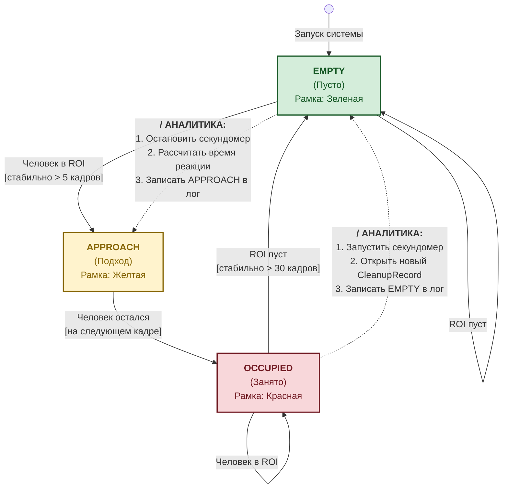

# table-watcher
Прототип системы компьютерного зрения для мониторинга состояния столика по видео. Детектирует присутствие человека (YOLO/OpenCV), фиксирует события (пусто, занято, подход), считает время реакции и базовую аналитику. Включает визуализацию ROI и смену состояния в реальном времени.

## Описание решения

Система строится на трёх последовательных этапах обработки каждого кадра видео.

**Детекция людей.** Каждый кадр передаётся в предобученную модель YOLOv8n. Из всех детекций оставляем только класс `person` с уверенностью выше порогового значения. Затем проверяем, попадает ли центр найденного bounding box в заранее заданную зону столика (ROI). Результат — булево значение: есть человек в зоне или нет.

**Конечный автомат (FSM).** Булево значение из детектора поступает в `TableMonitor` — класс, реализующий конечный автомат с тремя состояниями:

```
EMPTY ──► APPROACH ──► OCCUPIED ──► EMPTY ──► ...
```

Прямой переход из сигнала детектора в состояние не делается — между ними стоит дебаунс: состояние меняется только если детектор стабильно показывает одно и то же на протяжении `N` кадров подряд. Это защищает от мерцания модели при движении или перекрытии. Состояние `APPROACH` — особое: оно фиксируется исключительно при первом появлении человека после подтверждённого `EMPTY`, именно его временна́я метка используется как момент «подхода к столу».

**Аналитика.** Каждый переход состояния записывается с временно́й меткой в Pandas DataFrame. По парам событий `EMPTY → APPROACH` вычисляется время реакции для каждого цикла. Итоговая метрика — среднее, медиана, минимум и максимум времени между уходом гостей и первым подходом к столу.



## Отчет о проделанной работе
При разработки системы я использовал следующие подходы
1. Для переходов между состояниями я реализовал патерн машина состояний, где каждое состояние это отдельный класс, что позволяет гипко управлять каждым переходом, и легко добавлять новые состояния. Плюс благодаря такому подходу очень просто понять правила переходов между состояниями
2. Что бы решить проблемму дребезка я ввел пароговое значение которое нужно преодалеть, что бы перейти в новое состояние, это решает проблемму когда человек, проподает из кадра, например его голова перекрывается светильником или когда он начинает встовать из-за стола, без системы пароговых значение, система начинает колебаца и переходить то в состояни занято то в состояние свободно
3. Также я реализовал систему плагинов, что бы было легко добавлять новые функциональные возможности, не меняя и не вникая в существующий код
4. Реализованна функциональность которая делает кскриншот, в момент когда мы пытаемся перейти в новое состояние, что бы можно было легко анализировать работу системы